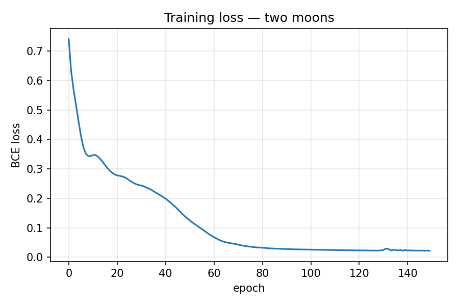
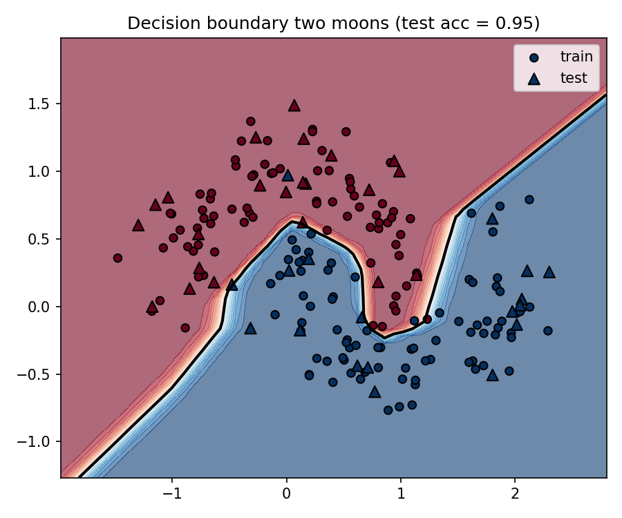
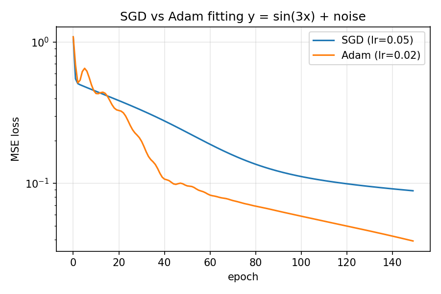
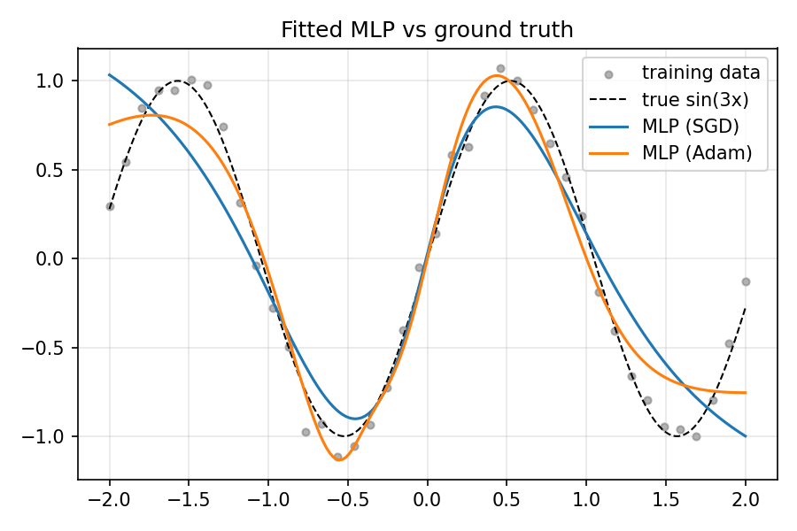
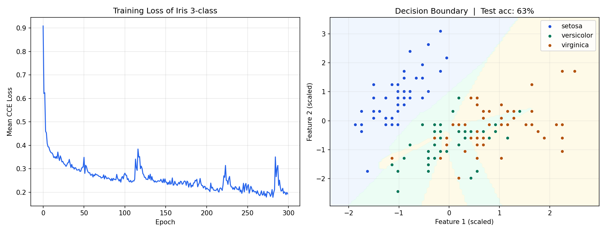

# microgradplus

A scalar-valued autograd engine and neural network library built from scratch
in pure Python.

The core library (`microgradplus/`) has **zero dependencies**. Every gradient
is computed by hand-written reverse-mode automatic differentiation over a
dynamically built computation graph, no NumPy, no PyTorch. The goal is that
nothing inside `loss.backward()` is mysterious.

```bash
git clone https://github.com/Nur2424/microgradplus
cd microgradplus
pip install -e .
```

## What is in here

```
microgradplus/
├── engine.py   # the Value class: scalar autograd
├── nn.py       # Neuron, Layer, MLP, MLPClassifier
├── losses.py   # MSE, binary cross-entropy, hinge, categorical cross-entropy
├── optim.py    # SGD (+momentum), Adam
├── training.py # fit() / predict() / predict_classes() training loop
└── viz.py      # computation graph visualization (graphviz)

tests/     # 44 tests, every gradient checked vs PyTorch + finite differences
examples/  # three end-to-end demos with generated plots
notebooks/ # derivation notebooks with full mathematical explanations
```


## Quick start

```python
import random
from microgradplus.nn import MLP
from microgradplus.losses import mse_loss
from microgradplus.optim import Adam
from microgradplus.training import fit, predict

random.seed(42)
model = MLP(nin=2, nouts=[16, 16, 1], activation="tanh", out_activation="linear")

X = [[0.0, 0.0], [0.0, 1.0], [1.0, 0.0], [1.0, 1.0]]
y = [0.0, 1.0, 1.0, 0.0]  # XOR

opt = Adam(model.parameters(), lr=0.05)
fit(model, opt, mse_loss, X, y, epochs=200, log_every=50)

print(predict(model, X))
```

## The engine

Everything is built on one class, `Value`, which wraps a scalar and remembers
the operation and operands that produced it:

```python
from microgradplus.engine import Value

a = Value(2.0)
b = Value(-3.0)
c = Value(10.0)
d = a * b + c
L = d.tanh()

L.backward()
print(a.grad, b.grad, c.grad)
```

Each operator (`+`, `*`, `**`, `exp`, `log`) and activation (`tanh`,
`sigmoid`, `relu`, `leaky_relu`) attaches a closure its local derivative
rule to the output node. `.backward()` builds a reverse topological
ordering of the graph via DFS and calls each node's local rule in reverse
order, accumulating gradients with `+=` (the multivariate chain rule across
multiple paths the same accumulation property that motivates
`optimizer.zero_grad()`)

| microgradplus concept | PyTorch equivalent |
|---|---|
| `Value` | `torch.Tensor` with `requires_grad=True` |
| `_prev`, `_op` | the autograd graph (`grad_fn` chain) |
| `_backward` closure | `Function.backward` |
| `Value.backward()` | `Tensor.backward()` |
| `optimizer.zero_grad()` | `for p in params: p.grad = 0.0` |
| `SGD.step()` / `Adam.step()` | `optimizer.step()` |

## Design choices

**Activations and initialization are paired deliberately.** `nn.py` exposes
`activation="tanh"|"sigmoid"|"relu"|"leaky_relu"|"linear"` and
`init="uniform"|"xavier"|"he"`. Xavier/Glorot initialization keeps activation
variance roughly constant across layers for saturating activations (tanh,
sigmoid); He initialization compensates for ReLU zeroing out about half its
inputs. The original micrograd used `uniform(-1, 1)` everywhere, which works
for a 4-point toy dataset but saturates tanh units as networks grow.

**Losses are framed as maximum-likelihood objectives**, following the
negative-log-likelihood-to-loss correspondence: Gaussian noise on a continuous
target gives MSE; a Bernoulli label gives binary cross-entropy; categorical
targets give categorical cross-entropy derived from the full MLE argument. For
sigmoid + BCE, the gradient with respect to the pre-sigmoid logit is exactly
`(prediction - target) / N` the single most-reused gradient in
classification, verified directly in `tests/test_losses.py`. For softmax +
CCE, the gradient collapses to `p_i - y_i` the cleanest result in
multi-class classification, derived in full in
`notebooks/02_softmax_cce.ipynb`

**Optimizers are separated from the model**, mirroring `torch.optim`. `SGD`
supports momentum (an exponential moving average of past gradients, damping
oscillations in narrow valleys); `Adam` additionally tracks a per-parameter
second-moment estimate so the effective step size adapts to how noisy each
parameter's gradient has been. Both bias-correction terms in Adam are derived
analytically, not just copied from the paper.

## Correctness

Every operation and activation in `engine.py` is tested two ways:

1. **Against PyTorch's autograd** on identical expressions (`test_engine.py`,
   `test_losses.py`)
2. **Against finite-difference numerical derivatives**
   (`test_finite_difference_matches_backward`)

```bash
pip install -e ".[dev]"
pytest -v
```

44/44 tests pass

## Examples

### 1. Binary classification, Two Moons

An MLP with ReLU hidden units (He initialization) and a sigmoid output,
trained with Adam and binary cross-entropy on `sklearn.datasets.make_moons`.
scikit-learn and matplotlib are used only for data generation and plotting.
Every gradient and every parameter update comes from `microgradplus`.

The decision boundary is non-linear and complex — the kind of shape that a
single linear layer could never produce. The network learned it entirely
through scalar-level reverse-mode autodiff, one `Value` node at a time.

Test accuracy: **0.95**

| Training loss | Decision boundary |
|---|---|
|  |  |

The contour lines show the model's confidence gradient away from the
boundary the network is not just classifying correctly, it is increasingly
certain as points move further from the decision surface.

---

### 2. Regression, Fitting `sin(3x)` with SGD vs Adam

Two structurally identical MLPs, same architecture, same random seed, same
data the only difference is the optimizer. One trained with plain SGD,
the other with Adam. This isolates the optimizer's effect cleanly.

| Loss curves (log scale) | Fitted curves |
|---|---|
|  |  |

The loss curves show Adam converging faster and reaching a lower final loss.
The fitted curve plot makes the practical difference concrete: both networks
fit the central region well, but Adam tracks the true `sin(3x)` more
faithfully across the full range within the same number of steps.

The gap is not because SGD is broken it is because Adam maintains
per-parameter adaptive learning rates and bias-corrected moment estimates,
letting it take more informed steps where the gradient is noisy or the loss
surface is curved unevenly. The Adam optimizer in `microgradplus/optim.py`
implements this from scratch, including the bias-correction terms derived
analytically.

---

### 3. Multi-class classification, Iris (softmax + CCE)

An MLPClassifier with ReLU hidden units (He initialization) and a softmax
output, trained with Adam and categorical cross-entropy on the first two
features of the Iris dataset. This example demonstrates the softmax and CCE
extension built on top of the scalar engine.

| Training loss + decision boundary |
|---|
|  |

Test accuracy: **63.3%** and this number is correct, not a bug

Only two of the four Iris features are used (sepal length and sepal width),
intentionally, to keep the problem visualizable in 2D. In this reduced feature
space, versicolor and virginica overlap significantly the decision boundary
plot shows this directly. With all four features the same architecture reaches
95%+. The 63% result is an honest demonstration of what two-feature Iris
looks like, not a failure of the implementation.

The loss curve shows characteristic spikes, Adam occasionally overshoots in
narrow regions of the loss surface before recovering. This is expected behavior
at `lr=0.02` on a small dataset with mini-batch noise.

The softmax + CCE combination implemented here is derived in full in
`notebooks/02_softmax_cce.ipynb`, including the MLE derivation and the proof
that the gradient collapses to `p_i - y_i`. The same gradient identity drives
training of every modern language model.

## The notebooks

`notebooks/01_micrograd_from_scratch.ipynb` is where this started: a
from-scratch derivation of backpropagation, building `Value` incrementally
(forward pass, manual gradients, closures, topological sort), with every
analytical gradient checked against finite differences and PyTorch along the
way.

`notebooks/02_softmax_cce.ipynb` derives the softmax and categorical
cross-entropy loss from the MLE perspective, proves the `p_i - y_i` gradient
collapse, and connects directly to
[`language-models-from-scratch`](https://github.com/Nur2424/language-models-from-scratch)
where the same math drives character-level language model training.

The library in `microgradplus/` is the same engine as in the notebooks,
refactored into a reusable package and extended with more losses, activations,
initialization schemes, and optimizers.

## What this is not

**This is a learning and portfolio project, not a production framework.** There is
no vectorization (everything is scalar `Value`s an MLP forward pass is
O(number of weights) Python function calls), no GPU support, and no batching
beyond simple Python loops. The engineering that PyTorch adds on top
vectorized tensors, fused kernels, an iterative topological sort, gradient
checkpointing is real and substantial. The point here is that the
mathematical content underneath all of that is exactly this.

## What comes next `tensorgrad`

`microgradplus` operates at the scalar level: every number in the network is
an individual `Value` node, and the computation graph grows one scalar
operation at a time. This is the right level for understanding why autograd
works, but not how it works efficiently.

The natural next step is [`tensorgrad`](https://github.com/Nur2424/tensorgrad)
a tensor-level autograd engine built from scratch. Instead of tracking
individual scalars, it tracks full matrix operations: `matmul`, `softmax`,
`cross_entropy`, `layer_norm`, `batchnorm` each with hand-derived tensor
gradients rather than scalar ones.

The endpoint of `tensorgrad` is training a character-level language model
without PyTorch the same architecture as in
[`language-models-from-scratch`](https://github.com/Nur2424/language-models-from-scratch),
but with the autograd engine replaced entirely by hand-written tensor
gradients.

The progression across the three repositories tells one coherent story:

| Repository | Level | What it shows |
|---|---|---|
| `microgradplus` | scalar | autograd from first principles |
| `tensorgrad` | tensor | efficient gradients through matrix operations |
| `language-models-from-scratch` | model | applying autograd to build GPT-style models |

## References and further reading

Built while working through Andrej Karpathy's
[Neural Networks: Zero to Hero](https://karpathy.ai/zero-to-hero.html),

### The papers below were studied alongside the implementation:

- **Backpropagation** — Rumelhart, Hinton, Williams (1986). *Learning
  representations by back-propagating errors.* Nature.
  The original paper that formalized reverse-mode autodiff for neural networks.

- **Adam optimizer** — Kingma, Ba (2014). *Adam: A Method for Stochastic
  Optimization.* [arxiv.org/abs/1412.6980](https://arxiv.org/abs/1412.6980)
  The bias-correction terms in `microgradplus/optim.py` are derived directly
  from Section 2 of this paper.

- **Xavier/Glorot initialization** — Glorot, Bengio (2010). *Understanding
  the difficulty of training deep feedforward neural networks.* AISTATS.
  The initialization scheme in `nn.py` for tanh/sigmoid activations.

- **He initialization** — He et al. (2015). *Delving Deep into Rectifiers.*
  [arxiv.org/abs/1502.01852](https://arxiv.org/abs/1502.01852)
  The initialization scheme in `nn.py` for ReLU activations.

- **Batch Normalization** — Ioffe, Szegedy (2015). *Batch Normalization:
  Accelerating Deep Network Training by Reducing Internal Covariate Shift.*
  [arxiv.org/abs/1502.03167](https://arxiv.org/abs/1502.03167)
  Background reading for the normalization context in the notebooks.
